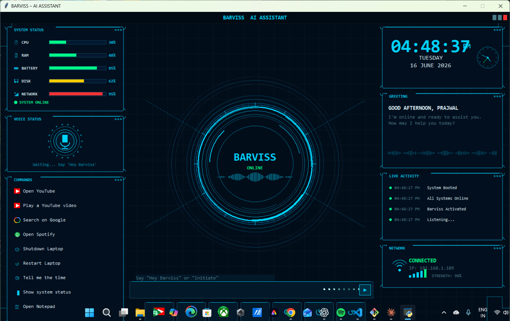

#BARVISS — AI Desktop Assistant

##Detailed Description
BARVISS is not just another voice assistant script. It is a complete AI-powered desktop experience built from scratch using pure Python. The moment you say "Initiate" or "Hey Barviss," the application wakes up from the background, pops open a full-screen futuristic HUD interface, glows its microphone ring green, and says "Yes Prajwal, I'm listening" — ready for your command.
Every single action Barviss takes is announced out loud. When you say open YouTube, it says "Opening YouTube for you." When you say shutdown, it counts down and says "Shutting down in 5 seconds, have a great day Prajwal." It feels alive. It feels like a real assistant.
The GUI itself is a work of art — dark navy background, animated rotating cyan arc rings, a live voice waveform that pulses when Barviss speaks, a real-time digital and analog clock, live system stats with color-coded bars, a timestamped activity log, and clickable quick-action buttons for every major function. Every detail was hand-drawn using Python's tkinter canvas — no external UI framework, no web view, just raw canvas drawing code.
BARVISS runs completely silently in the background the moment Windows boots. There is no terminal window, no desktop shortcut to click, no VS Code to open. It just runs invisibly, sitting in your system tray, always listening, always ready. The only thing you ever need to do is speak.

Libraries Used — Full Detail
tkinter

This is the core of the entire GUI. Every single element you see on screen — the dark panels, the rotating rings, the progress bars, the clock hands, the voice waveform, the animated dots — is drawn manually on a tkinter Canvas widget using raw coordinate-based drawing. No image files are used for the UI. Everything is rendered in real time using lines, arcs, ovals, polygons, and rectangles. tkinter comes built into Python so no installation is needed.
SpeechRecognition

This library handles all microphone input. It captures audio from your microphone in real time, sends it to Google's Speech Recognition API over the internet, and returns the text of what you said. It runs in a dedicated background thread so it never freezes or slows down the GUI. It has two phases — first it listens quietly for the wake word, and once triggered it switches to command mode and listens for your instruction. It also handles timeout gracefully and tells you if it didn't understand.
pyttsx3

This is the text-to-speech engine that gives Barviss its voice. Every reply, every action confirmation, every greeting — all of it is spoken aloud through your speakers using pyttsx3. It works completely offline, requires no API key, and supports multiple voices. On Windows it uses Microsoft's built-in SAPI5 voices. The engine runs in a dedicated queue-based thread so speaking never blocks the GUI or the listener.
PyAudio

This is the low-level audio backend that SpeechRecognition uses to access your microphone hardware. It handles the raw audio stream capture from your system's input device. Without PyAudio, the microphone cannot be accessed at all. It is the bridge between your physical microphone and the speech recognition layer.
pystray

This library creates the system tray icon that appears in the bottom-right corner of your Windows taskbar. It gives Barviss a presence in the background even when the GUI is hidden. Right-clicking the tray icon gives options to show the GUI or quit completely. This is what makes Barviss feel like a real system-level application rather than just a Python script.
Pillow — PIL

Pillow is used alongside pystray to programmatically generate the system tray icon. Since there is no external icon image file, Pillow draws a small cyan circle with the letter B on a transparent background entirely in code. This generated image is then passed to pystray as the tray icon.
threading

Python's built-in threading module is used extensively throughout Barviss. The voice listener runs on its own thread. The text-to-speech engine runs on its own thread with a queue. The system tray runs on its own thread. This multi-threaded architecture ensures the GUI always stays smooth and responsive at 20 frames per second while all the voice and audio work happens completely in the background.
queue

Python's built-in queue module is used to safely pass text-to-speech requests from the main thread to the TTS worker thread. This prevents any race conditions and ensures that if multiple replies come quickly, they are spoken one after another in the correct order without overlapping or crashing.
subprocess

This module is used to launch external applications and run system commands. When you say open Notepad, subprocess launches it. When you say shutdown, subprocess calls the Windows shutdown command. When you say take a screenshot, subprocess opens the Snipping Tool. It handles all direct OS-level interactions and works cross-platform with different commands for Windows, Linux, and macOS.
webbrowser

Python's built-in webbrowser module is used for all browser-based commands. Opening YouTube, searching Google, opening Spotify Web, checking weather — all of these open directly in your default browser using this module. No browser-specific dependencies are needed.
datetime

Python's built-in datetime module powers the live clock. It fetches the current time every half second to update the digital display, move the analog clock hands, show the correct day and date, and generate time-aware greetings like Good Morning or Good Evening.
math

Python's built-in math module handles all the trigonometry behind the animated GUI elements. The rotating arc positions, the clock hand angles, the mic ring dot positions, the tick mark placements around the center ring — all of it is calculated using sine, cosine, and radians from the math module.
random

Python's built-in random module is used for two things. First, it adds natural variation to the voice waveform animation so it looks organic and alive rather than perfectly mechanical. Second, it randomly selects from multiple possible responses for greetings and jokes so Barviss feels less repetitive over time.
platform

Python's built-in platform module detects whether Barviss is running on Windows, Linux, or macOS. This allows every command — launching apps, adjusting volume, locking the screen, shutting down — to use the correct system-specific method automatically without any manual configuration from the user.
sys and os

These built-in modules handle file paths, process management, environment variables, and clean application exit. They ensure Barviss can find its own files regardless of where it is installed, and that it shuts down all threads cleanly when the user quits.

What Makes It Different
Most voice assistants are either cloud-dependent, terminal-based, or have plain boring interfaces. BARVISS is different because the GUI itself is a statement — it looks like something from Iron Man. The voice is not a beep or a notification, it is a full spoken response for every single action. It does not require you to open anything. It starts with Windows and lives in your tray. And it is built entirely in Python with no Electron, no React, no web tech — just pure Python doing things most people think Python cannot do visually.
